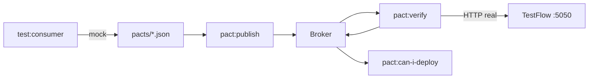

# testflow-pact

Contract testing com [Pact.js](https://github.com/pact-foundation/pact-js) contra o **TestFlow** (`qaschool/testflow:latest`).

Repositório de automação **separado** do app — o ambiente sobe com `docker compose` **deste** projeto (mesmo padrão dos outros `testflow-*`).

## Pré-requisitos

- [Docker Desktop](https://www.docker.com/products/docker-desktop/) em execução
- [Node.js](https://nodejs.org/) **22+** (`@pact-foundation/pact` v17)
- `npm`

## Nomes no Pact

| Papel | Nome |
|-------|------|
| Provider (API) | `sandbox-api` |
| Consumer (web) | `testflow-web` |
| Consumer (mobile) | `mobile-app` |

- Provider real: imagem `qaschool/testflow:latest` — **sem** clone/build do repo [testflow](https://github.com/qaschoolbr/testflow)
- Broker: `pactfoundation/pact-broker` + Postgres — **não** usar `/api/contracts/*` do TestFlow

## Endpoints cobertos

| Método | Path | Consumer |
|--------|------|----------|
| GET | `/health` | `mobile-app` |
| GET | `/api/meta` | `testflow-web` |
| GET | `/api/users` | `testflow-web` |
| GET | `/api/users?role=admin` | `testflow-web` |
| GET | `/api/users/:id` | `testflow-web` |
| GET | `/api/products` | `testflow-web` |
| POST | `/api/auth/login` | `testflow-web` |
| POST | `/api/auth/login` (401) | `testflow-web` |
| GET | `/api/auth/me` | `testflow-web` |
| POST | `/api/orders` | `testflow-web` |

## Estrutura

```
testflow-pact/
├── docker-compose.yml
├── src/
│   ├── pact/                 # constants, createPact, matchers
│   ├── lib/env.ts
│   ├── types/sandbox-api.ts
│   ├── fixtures/credentials.ts
│   ├── consumers/
│   │   ├── mobile-app/health/
│   │   └── testflow-web/
│   │       ├── auth/
│   │       ├── users/
│   │       ├── catalog/
│   │       └── meta/
│   └── provider/
│       ├── verify.ts
│       ├── verifier-config.ts
│       └── state-handlers/
├── scripts/
│   ├── publish-pacts.ts
│   └── can-i-deploy.ts
└── pacts/                    # gerado (gitignored)
```

## Setup

```bash
cp .env.example .env
npm install
npm run docker:up
```

Na **primeira execução**, o Docker baixa imagens (`testflow`, `pact-broker`, `postgres`) — pode levar alguns minutos.

```bash
docker compose ps
curl http://localhost:5050/health
curl -u pact:pact http://localhost:9292/diagnostic/status/heartbeat
```

- TestFlow: http://localhost:5050
- Pact Broker UI: http://localhost:9292 (login: `pact` / `pact`)

## Fluxo completo (host)



```bash
# 1. Consumer tests (mock — TestFlow não precisa estar no ar)
npm run test:consumer

# 2. Publish no broker
npm run docker:up
npm run pact:publish

# 3. Provider verification (TestFlow real)
npm run pact:verify

# 4. Gate de deploy
npm run pact:can-i-deploy
```

Atalhos:

```bash
npm run test:consumer:publish   # passos 1 + 2
npm run docker:test             # tudo dentro do Docker (ver abaixo)
```

## Scripts npm

| Script | O que faz |
|--------|-----------|
| `npm test` | Smoke Vitest |
| `npm run test:consumer` | Consumer tests → gera `pacts/*.json` |
| `npm run pact:publish` | Publica pacts no broker |
| `npm run pact:verify` | Verifica provider contra broker + TestFlow |
| `npm run pact:can-i-deploy` | Checa se pode deployar o par consumer/provider |
| `npm run docker:up` | Sobe TestFlow + broker + postgres |
| `npm run docker:down` | Para containers |
| `npm run docker:test` | Pipeline completo dentro da rede Docker |

## Variáveis de ambiente (`.env`)

| Variável | Uso |
|----------|-----|
| `PROVIDER_BASE_URL` | TestFlow no host (`http://localhost:5050`) |
| `PACT_BROKER_BASE_URL` | Broker no host (`http://localhost:9292`) |
| `PACT_CONSUMER_VERSION` | Versão do consumer no publish — **incremente** ao alterar o pact |
| `PACT_PROVIDER_VERSION` | Versão do provider reportada na verificação |
| `PACT_CONSUMER_TAG` | Tag no broker (ex.: `main`) |
| `PACT_CONSUMER_NAME` / `PACT_PROVIDER_NAME` | Usados no `can-i-deploy` |

## Runner no Docker

Para CI ou quem não quer Node local:

| Host (`.env`) | Dentro do Compose |
|---------------|-------------------|
| `http://localhost:5050` | `http://testflow:5050` |
| `http://localhost:9292` | `http://pact-broker:9292` |

```bash
npm run docker:up
npm run docker:test
```

O serviço `test-runner` (profile `test`) roda: `npm ci` → consumer → publish → verify.

## GitHub Actions

Workflow: [`.github/workflows/contract-tests.yml`](.github/workflows/contract-tests.yml)

Dispara em **push/PR para `main`** e em **workflow_dispatch**.

### O que a pipeline faz

1. Sobe TestFlow + Pact Broker + Postgres (`docker compose`)
2. `test:consumer` → gera pacts
3. `pact:publish` → publica no broker (versão = `github.sha`)
4. `pact:verify` → valida TestFlow real
5. `pact:can-i-deploy` → **gate** — falha bloqueia o job
6. Job `deploy` só roda em **push na `main`** se o passo 5 passou

### Bloquear merge/deploy

No GitHub: **Settings → Branches → Branch protection** → exija o check:

`Pact — consumer, verify, can-i-deploy`

PRs com contrato quebrado ou verificação falha **não passam**. O job `Deploy` é um placeholder — troque pelo seu comando real de deploy.

### Broker externo (produção)

Para CI apontando a um broker hospedado, defina secrets e sobrescreva no workflow:

```yaml
env:
  PACT_BROKER_BASE_URL: ${{ secrets.PACT_BROKER_BASE_URL }}
  PACT_BROKER_USERNAME: ${{ secrets.PACT_BROKER_USERNAME }}
  PACT_BROKER_PASSWORD: ${{ secrets.PACT_BROKER_PASSWORD }}
```

Neste workflow o broker sobe **ephemeral** no runner (ideal para aprendizado; em produção use broker persistente).

## Troubleshooting

### Docker Desktop não está rodando

```
failed to connect to the docker API at npipe://...
```

Abra o Docker Desktop e aguarde ficar **Running** antes de `docker compose up`.

### Porta 5050 ou 9292 em uso

Altere no `.env`:

```env
TESTFLOW_PORT=5051
PACT_BROKER_PORT=9293
PROVIDER_BASE_URL=http://localhost:5051
PACT_BROKER_BASE_URL=http://localhost:9293
```

### TestFlow ainda em warm-up

Na 1ª execução, `curl http://localhost:5050/health` pode falhar por alguns segundos. Aguarde e tente de novo.

### Broker `unhealthy` no `docker compose ps`

O broker pode responder `200` no heartbeat mas aparecer `unhealthy` (healthcheck interno). Se `curl -u pact:pact http://localhost:9292/diagnostic/status/heartbeat` retorna OK, o broker está funcional.

### `fetch failed` no `pact:publish`

O broker não está no ar. Rode `npm run docker:up` e aguarde o Postgres ficar `healthy`.

### `409` ao republicar o mesmo `PACT_CONSUMER_VERSION`

O broker não permite alterar o conteúdo de uma versão já publicada. Incremente:

```env
PACT_CONSUMER_VERSION=0.1.3
```

### `can-i-deploy` retorna `no`

Verifique se `pact:verify` passou para as versões em `.env` e se as versões batem com o que foi publicado/verificado.

### Provider verification falha no body/header

- **Timestamp:** use regex que aceite milissegundos (`...T12:00:00.000Z`)
- **Content-Type:** prefira `application/json` se o TestFlow não enviar `charset=utf-8`

### Windows + `docker:test`

O volume `test_node_modules` evita misturar `node_modules` do Windows com o container Linux. Não apague esse volume entre runs se quiser runs mais rápidos.

### `host.docker.internal`

Neste projeto **não é necessário** — o `test-runner` usa `http://testflow:5050` na rede Docker. Use `host.docker.internal` só se um container precisar alcançar um serviço rodando **fora** do Compose no host.

### `@pact-foundation/pact` pede Node 22

No container `test-runner` (Node 20) pode aparecer `EBADENGINE` — geralmente funciona. Para eliminar o aviso, use Node 22+ localmente.

## O que NÃO fazer

- Não usar `/api/contracts/publish` ou `/verify` do TestFlow (broker simulado)
- Não exigir clone/build do repo testflow — só a imagem Docker Hub
- Não commitar `.env` nem `pacts/` (gerados localmente)

## Referências

- [TestFlow](https://github.com/qaschoolbr/testflow)
- [Pact.js](https://github.com/pact-foundation/pact-js)
- [Pact Broker](https://docs.pact.io/pact_broker)
